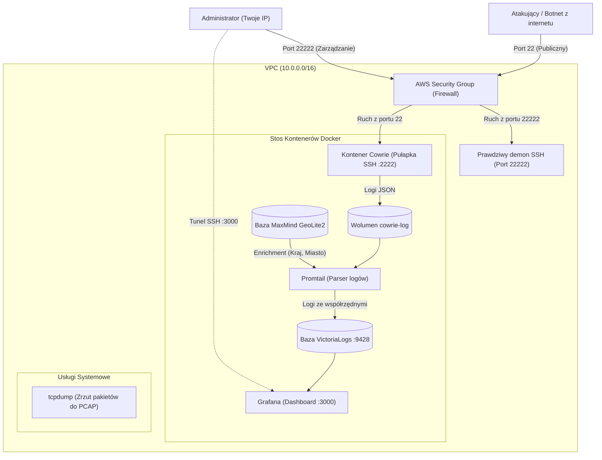
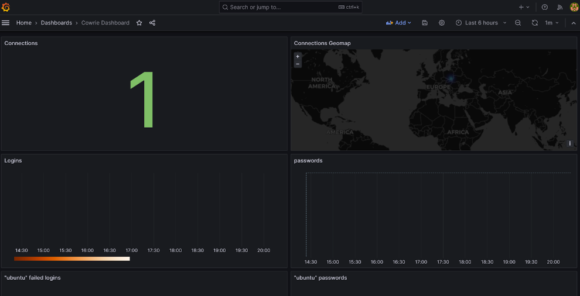
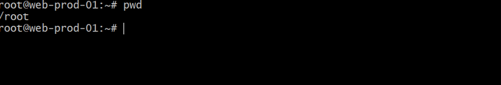
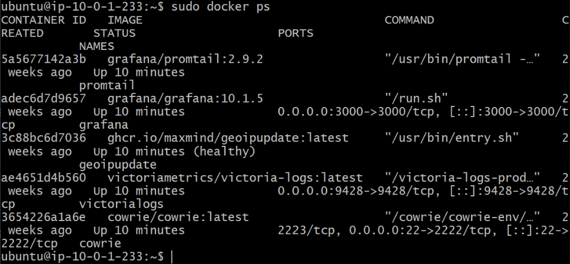

# AWS SSH Honeypot (Cowrie, VictoriaLogs & Grafana)

Zautomatyzowane środowisko honeypot SSH w chmurze AWS z pułapką Cowrie, lekką bazą logów VictoriaLogs, wzbogacaniem zdarzeń o geolokalizację GeoIP (MaxMind) oraz interaktywną wizualizacją w Grafanie. Całość wdrażana jako kod (IaC) za pomocą Terraforma w odizolowanym VPC z separacją portu pułapki (22) od administracyjnego (22222).

---

## Komponenty architektury

1. **Pułapka SSH (Cowrie):**
   * Kontener Dockera nasłuchujący na publicznym porcie 22, emulujący podatną powłokę Linuksa.
   * Przechwytuje próby uwierzytelnienia (loginy, hasła), adresy IP atakujących, wpisywane polecenia oraz nagrywa sesje terminala (TTY).

2. **Parser i Geolokalizacja (Promtail + MaxMind GeoIP):**
   * Promtail monitoruje generowane przez Cowrie logi w formacie JSON.
   * Na bieżąco odpytuje lokalną bazę MaxMind GeoLite2, wzbogacając każdy wpis o kod kraju, miasto oraz współrzędne geograficzne atakującego adresu IP.

3. **Baza Logów (VictoriaLogs):**
   * Wysoko wydajna, lekka baza danych zoptymalizowana pod kątem minimalnego zużycia pamięci RAM na instancji darmowego pakietu AWS (`t3.micro`).
   * Zastępuje zasobożerne stosy typu ELK czy Grafana Loki.

4. **Wizualizacja i Analityka (Grafana):**
   * Interaktywny dashboard prezentujący mapę ataków w czasie rzeczywistym, statystyki najczęściej testowanych haseł i nazw użytkowników.
   * Panel dostępny wyłącznie lokalnie przez bezpieczny tunel SSH (brak publicznego portu 3000 w internecie).

5. **Podsłuch Pakietów (tcpdump):**
   * Usługa systemowa działająca w tle, rejestrująca surowy ruch sieciowy na porcie 22 do rotowanych plików `.pcap` (do głębszej analizy w Wireshark).

6. **Kordon Sanitarny (Reguły iptables):**
   * Reguły firewall blokujące ruch wychodzący z kontenera pułapki na porty HTTP/HTTPS (80, 443), DNS (53) i SMTP (25), uniemożliwiające wykorzystanie honeypota do rozsyłania złośliwego oprogramowania czy spamu.

---

## Schemat Połączeń Sieciowych



---

## Prezentacja działania systemu

### 1. Panel Grafana – Analiza ataków i geolokalizacja GeoIP w czasie rzeczywistym


### 2. Emulowane środowisko Cowrie – Widok z perspektywy atakującego


### 3. Aktywne kontenery stosu honeypota (`docker ps`)


---

## Decyzje architektoniczne i bezpieczeństwo

### 1. Separacja portu pułapki (22) i portu administracyjnego (22222)
* **Jak było:** Tradycyjne serwery Linux nasłuchują na porcie 22 na potrzeby administracji.
* **Dlaczego zmieniono:** Aby port 22 mógł posłużyć jako publiczna pułapka na boty, prawdziwy demon SSH musiał zostać przeniesiony na inny port.
* **Co zrobiono:** Podczas startu instancji skrypt instalacyjny rekonfiguruje OpenSSH na port 22222 i blokuje dostęp do niego w Security Group wyłącznie dla zaufanego adresu IP administratora. Port 22 zostaje uwolniony i przekazany kontenerowi Cowrie.

### 2. Zastąpienie Grafana Loki przez VictoriaLogs
* **Jak było:** Pierwotna wersja projektu wykorzystywała Grafana Loki jako silnik przechowywania logów.
* **Dlaczego zmieniono:** Loki wraz z zależnościami wymaga znacznych zasobów pamięci RAM, co na maszynach AWS Free Tier (`t2.micro` / `t3.micro` z 1 GB RAM) wywoływało przeciążenia i zabijanie procesów przez mechanizm OOM Killer.
* **Co zrobiono:** Wdrożono bazę VictoriaLogs, która zużywa ułamek pamięci, jest wybitnie szybka i natywnie integruje się z Grafaną za pośrednictwem dedykowanego pluginu.

### 3. Zabezpieczenie panelu Grafany tunelem SSH (Zero Public Port 3000)
* **Jak było:** Panele wizualizacyjne bywają wystawiane bezpośrednio do internetu na porcie 3000.
* **Dlaczego zmieniono:** Publiczny panel analityczny to kolejny wektor ataku oraz ryzyko nieautoryzowanego wglądu w zebrane dane wywiadowcze o atakach.
* **Co zrobiono:** Port 3000 jest całkowicie odcięty w Security Group. Dostęp do dashboardu odbywa się wyłącznie za pośrednictwem szyfrowanego tunelu SSH forwardowanego na `localhost:3000`.

### 4. Kordon sanitarny w iptables (Egress containment)
* **Jak było:** Domyślnie kontenery Dockera mają pełny dostęp wychodzący do internetu.
* **Dlaczego zmieniono:** Jeśli atakujący uzyska dostęp do emulowanej powłoki Cowrie, może próbować pobierać zewnętrzne exploity (`wget`/`curl`) lub wysyłać spam (port 25).
* **Co zrobiono:** Wdrożono reguły `iptables` blokujące ruch wychodzący z podsieci kontenera Cowrie na porty 80, 443, 53 i 25, skutecznie izolując środowisko.

---

## Uruchomienie

### Wymagania wstępne:
* [Terraform](https://developer.hashicorp.com/terraform/downloads) >= 1.5.0
* [AWS CLI](https://aws.amazon.com/cli/) skonfigurowane z uprawnieniami do EC2 i VPC
* Darmowe konto i klucz licencyjny [MaxMind GeoLite2](https://www.maxmind.com/en/geolite2/signup) (do geolokalizacji ataków)

### 1. Przygotowanie klucza SSH:
Utwórz parę kluczy SSH w konsoli AWS EC2 (lub przez AWS CLI):
```bash
aws ec2 create-key-pair --key-name honeypot-key --query 'KeyMaterial' --output text > honeypot-key.pem
chmod 400 honeypot-key.pem
```

### 2. Konfiguracja zmiennych:
Skopiuj plik szablonu i uzupełnij sekrety:
```bash
cp terraform.tfvars.example terraform.tfvars
```

Edytuj `terraform.tfvars`:
```hcl
key_name                = "honeypot-key"
grafana_admin_password  = "TwojeSilneHasloGrafana123!"
geoipupdate_account_id  = "TWOJE_ID_KONTA_MAXMIND"
geoipupdate_license_key = "TWOJ_KLUCZ_LICENCYJNY_MAXMIND"
```

### 3. Wdrożenie infrastruktury:
```bash
terraform init
terraform apply
```
Po zakończeniu wdrożenia Terraform wyświetli publiczny adres IP serwera oraz gotowe polecenia dostępu.

### 4. Przetestowanie pułapki (Symulacja ataku):
Spróbuj zalogować się na publiczny port 22 jako nieautoryzowany użytkownik:
```bash
ssh root@<PUBLICZNE_IP>
```
Podaj dowolne hasło (np. `root`, `123456`). Cowrie wpuści Cię do emulowanego środowiska i zarejestruje Twoją sesję.

### 5. Dostęp do dashboardu Grafana:
Zestaw bezpieczny tunel SSH:
```bash
ssh -i honeypot-key.pem -L 3000:localhost:3000 -p 22222 ubuntu@<PUBLICZNE_IP>
```
Otwórz przeglądarkę i przejdź pod adres: `http://localhost:3000` (login: `admin`, hasło z `terraform.tfvars`).

### 6. Pobranie zrzutów ruchu sieciowego (PCAP):
```bash
scp -i honeypot-key.pem -P 22222 "ubuntu@<PUBLICZNE_IP>:/opt/honeypot/pcap_data/*.pcap" .
```

### 7. Usunięcie środowiska:
Aby usunąć instancję i uniknąć kosztów:
```bash
terraform destroy
```

---

## Struktura projektu

```text
.
├── docs/
│   └── images/             # Zrzuty ekranu z działającego środowiska i panelu Grafana
├── main.tf                 # Infrastruktura AWS: VPC, podsieć, Security Group, EC2
├── variables.tf            # Definicje zmiennych i parametrów konfiguracyjnych
├── outputs.tf              # Gotowe polecenia CLI (tunel SSH, pobieranie PCAP, test ataku)
├── user_data.tftpl         # Szablon instalacyjny (Docker, Cowrie, VictoriaLogs, Promtail, iptables)
├── terraform.tfvars.example# Wzorcowy plik konfiguracyjny ze zmiennymi
├── .gitignore              # Blokada plików stanu (.tfstate), kluczy (.pem) i sekretów
└── README.md               # Dokumentacja techniczna projektu
```
